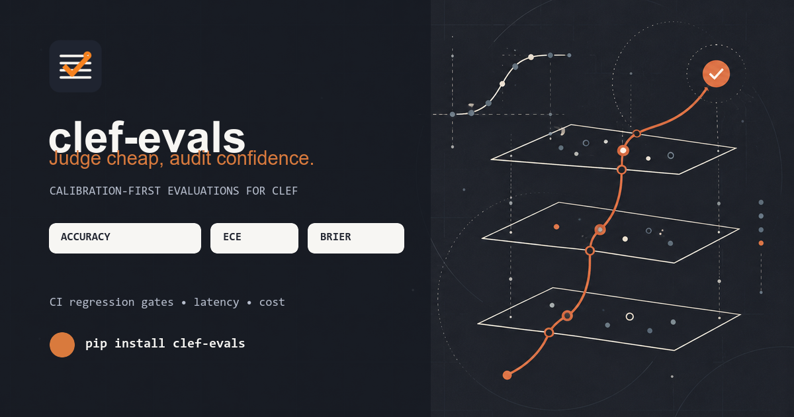
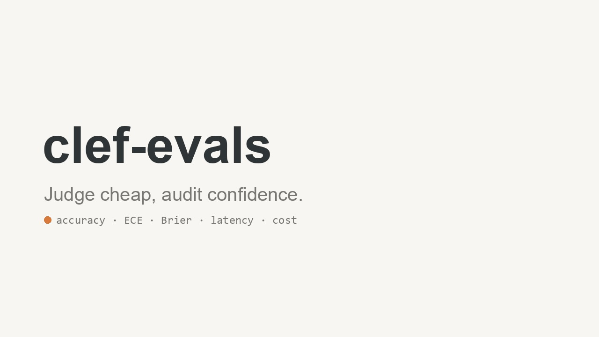
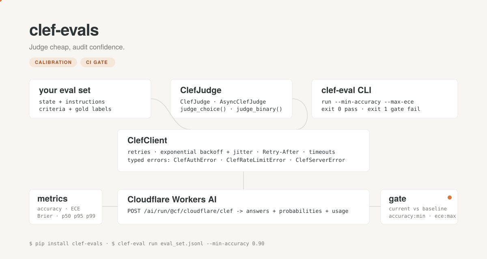

<p align="center">
  
</p>

<h1 align="center">clef-evals</h1>

<p align="center">
  <strong>Calibration-first evaluations for Cloudflare Clef decision models.</strong><br />
  Judge cheap, audit confidence.
</p>

<p align="center">
  <a href="https://github.com/Gjusev/clef-evals/actions/workflows/test.yml"></a>
  <a href="https://pypi.org/project/clef-evals/"></a>
  <a href="https://pypi.org/project/clef-evals/"></a>
  <a href="LICENSE"></a>
  <a href="https://developers.cloudflare.com/workers-ai/models/clef/"></a>
</p>

<p align="center">
  <a href="#quick-start">Quick start</a> ·
  <a href="#watch-it-work">Video</a> ·
  <a href="#reproduce-in-kaggle">Kaggle</a> ·
  <a href="research/clef_calibration_walkthrough.ipynb">Walkthrough notebook</a> ·
  <a href="#ci-regression-gate">CI gate</a>
</p>

<p align="center">
  
</p>

Most evaluation harnesses stop at accuracy. `clef-evals` also verifies whether a
model's stated probabilities deserve to be trusted. Run typed Clef decisions
against your dataset, measure Expected Calibration Error (ECE), Brier score,
latency and cost, then make regressions fail CI before they reach users.

## What you get

| Evaluate | Understand | Enforce |
| --- | --- | --- |
| Choice, binary and custom decision tasks through sync or async judges. | Accuracy, ECE, binary and multiclass Brier, latency percentiles, token use and estimated input cost. | A CLI gate and reusable GitHub Action that compare a fresh run with a committed baseline. |

- **Calibration, not just correctness.** A model that gets the label right but
  is consistently overconfident is a risk to downstream automation.
- **Operationally useful output.** Built-in timeouts, retries with jitter,
  `Retry-After` handling and typed, log-safe errors.
- **Reproducible by default.** A local walkthrough, public Kaggle kernels and
  versioned reference data live in the repository.

## Quick start

Requires Python 3.10+ and a Cloudflare account ID/API token with Workers AI
access. The only runtime dependency is `httpx`.

```bash
pip install clef-evals
export CLEF_ACCOUNT_ID=your_account_id
export CLEF_API_TOKEN=your_api_token
```

```python
from clef_evals import ClefJudge

judge = ClefJudge()  # configuration is read from the environment

result = judge.evaluate([
    {
        "state": "Email: I need a refund",
        "instructions": "Which team?",
        "criteria": {
            "billing": "Payments, invoices, refunds",
            "technical": "Bugs and outages",
            "sales": "Plans and upgrades",
        },
        "gold": "billing",
    },
    {
        "state": "Checkout is down for everyone",
        "instructions": "Is this urgent?",
        "gold": True,  # binary items use a boolean gold label
    },
])

print(result.summary())
```

```text
samples=2 failures=0
accuracy=1.0000
ece=0.0700
brier=0.0049 brier_multiclass=0.0082
latency_ms p50=210.1 p95=238.6 p99=238.6
input_tokens=240 output_tokens=16
cost: $0.000058 total | $0.028800 per 1k calls
```

Need throughput? `AsyncClefJudge` uses `httpx.AsyncClient` and a bounded
semaphore:

```python
import asyncio
from clef_evals import AsyncClefJudge

result = asyncio.run(AsyncClefJudge().evaluate(eval_set, concurrency=8))
```

For one-off decisions, `judge_choice()` returns the selected option and the
full probability distribution; `judge_binary()` returns `P(yes)`.

## Watch it work

<video src="https://raw.githubusercontent.com/Gjusev/clef-evals/main/brag-output/brag.mp4" poster="https://raw.githubusercontent.com/Gjusev/clef-evals/main/brag-output/brag.jpg" controls muted playsinline width="100%">
  <a href="brag-output/brag.mp4">Watch the 14-second clef-evals showcase video</a>
</video>

<p align="center">
  <a href="brag-output/brag.mp4"></a><br />
  <sub>If your README renderer does not play inline video, select the cover image to open it.</sub>
</p>

The video is rendered from [the project-owned renderer](brag-output/render_video.py)
with PIL and ffmpeg—no stock assets. It shows the evaluation pipeline, the
published benchmark comparison and a passing calibration gate.

## From eval set to gate

<p align="center">
  
</p>

```bash
# evaluate a JSON array or JSONL file with a readable summary
clef-eval run evals/data/support_routing.jsonl

# save the full machine-readable artifact
clef-eval run evals/data/support_routing.jsonl --json --output results/run.json

# fail CI if quality or calibration crosses a threshold
clef-eval run evals/data/support_routing.jsonl \
  --min-accuracy 0.90 --max-ece 0.15
```

Exit codes: `0` passed, `1` quality gate failed, `2` configuration or dataset
error. Failures after retry are reported in `result.failures`; direct library
users should inspect them rather than treating an incomplete run as healthy.

## CI regression gate

Commit a baseline generated from any `EvalResult.to_dict()` output, then
compare it with the latest artifact in a workflow:

```yaml
- uses: Gjusev/clef-evals/.github/actions/regression-gate@main
  with:
    current: results/run.json
    baseline: results/baselines/support-routing-clef.json
    metrics: |
      accuracy:min:0.03
      ece:max
      latency_p95:max:50
```

`accuracy:min:0.03` permits at most a 0.03 drop; `ece:max` permits no ECE
increase; `latency_p95:max:50` permits at most 50 ms of p95 growth. The action
is pure Python at gate time: it does not require credentials or network access.

## Reproduce in Kaggle

<p>
  <a href="https://www.kaggle.com/code/gjusev/clef-evals-benchmark"></a>
  <a href="https://www.kaggle.com/code/gjusev/clef-flash-hf-benchmark"></a>
</p>

- [**CPU benchmark notebook**](https://www.kaggle.com/code/gjusev/clef-evals-benchmark)
  runs a live benchmark when Kaggle secrets `CLEF_ACCOUNT_ID` and
  `CLEF_API_TOKEN` are available. Without them, it exercises the complete
  pipeline with a mock transport and runs the test suite.
- [**GPU / Hugging Face diagnostic**](https://www.kaggle.com/code/gjusev/clef-flash-hf-benchmark)
  reproducibly tests the official `clef-flash` loader. It currently OOMs on a
  Kaggle T4 because the loader does not shard across GPUs; the kernel records
  that diagnosis and is ready for the benchmark once sharding is supported.
- [**Local calibration walkthrough**](research/clef_calibration_walkthrough.ipynb)
  explains ECE and Brier from first principles, includes a reliability diagram
  and demonstrates an offline mock run—no credentials needed.

To publish a refreshed CPU kernel from this repository:

```bash
KAGGLE_API_TOKEN=... python -m kaggle kernels push -p kaggle-kernel
KAGGLE_API_TOKEN=... python -m kaggle kernels status gjusev/clef-evals-benchmark
KAGGLE_API_TOKEN=... python -m kaggle kernels output gjusev/clef-evals-benchmark -p out/
```

## Reference benchmarks

These are **Cloudflare's published Decision Index 0.2.1 measurements**, not
results produced by this toolkit. See the [Clef model card](https://huggingface.co/Cloudflare/clef),
[Cloudflare announcement](https://blog.cloudflare.com/clef-decision-models/)
and the versioned [reference JSON](evals/results/published_reference.json).

| Benchmark | Clef | Clef-flash | Jev | Laya |
| --- | ---: | ---: | ---: | ---: |
| BFCL · case exact | 98.5 | **98.8** | 95.8 | 38.1 |
| BANKING77 · macro-F1 | **94.2** | 90.9 | 79.7 | 14.3 |
| CLINC150+OOS · macro-F1 | **97.4** | 66.8 | 89.3 | 3.2 |
| When2Call · accuracy | 72.4 | 65.6 | **81.0** | 11.9 |
| ForecastBench · Brier (↓) | 13.9 | **10.6** | 17.4 | 41.1 |
| Median latency · ms | 209.3 | 38.8 | 524.1 | **5.8** |

Run your own data instead of treating those values as a promise:

```bash
make eval
python evals/run_eval.py --model @cf/cloudflare/clef-flash --concurrency 8
make test-integration
```

Published input price is $0.24 per million tokens (about $0.029 per 1,000
120-token calls). Cloudflare has not published output-token pricing; the
toolkit still reports output tokens so the calculation can be completed later.

## Limitations worth knowing

- Metrics audit calibration; they do not recalibrate a model for you.
- Mixed task types pool different confidence semantics. Prefer per-type runs
  when that distinction matters.
- Latency is measured client-side and includes your network round trip, so it
  is not directly comparable with Cloudflare's infrastructure-side medians.
- Clef / clef-flash self-hosting is outside the normal workflow: the published
  weights are large and the current official loader does not support the
  multi-GPU sharding needed for the Kaggle T4 experiment.
- This is a v0.x API. Legacy v0.1 names remain importable, but small breaking
  changes can happen before 1.0.

## Development

```bash
make install            # editable install with development extras
make test               # unit tests, integration tests excluded
make test-integration   # real API tests; requires CLEF_ACCOUNT_ID / CLEF_API_TOKEN
make lint               # ruff
make build              # wheel + source distribution
```

Project map: `src/clef_evals/` is the library; `tests/` holds unit fixtures;
`evals/` contains data, runner and reference results; `research/` holds the
notebook; `kaggle-kernel/` and `kaggle-kernel-hf/` are cloud reproductions;
`docs/` and `brag-output/` contain the diagram and video source.

## Social preview

[`assets/social-preview-v2.png`](assets/social-preview-v2.png) is the
1200×630 share image created for this release. Upload it in the repository's
**Settings → General → Social preview** to use it on GitHub link shares.

## License

Apache 2.0. See [LICENSE](LICENSE). Clef models are Apache 2.0 on
[Hugging Face](https://huggingface.co/Cloudflare/clef).
